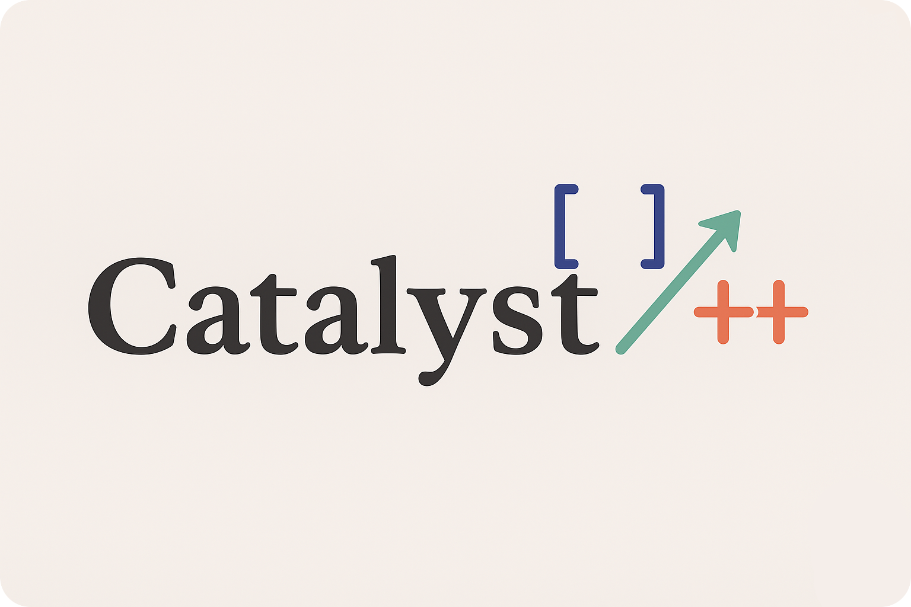

<p align="center">
  
  <br />
  <br />
  <strong>Catalyst</strong>
  <br />
  Vulkan-accelerated rendering & animation library with CPU fallbacks
  <br />
  <br />
  <a href="#"></a>
  <a href="#"></a>
  <a href="#"></a>
  <a href="#"></a>
</p>

<hr />

Catalyst is a GPU-accelerated C++ animation and rendering library built on Vulkan. Create mathematical animations, render 2D/3D scenes, and export videos - all with high performance GPU acceleration.

> [!NOTE]
> Catalyst was formerly known as **Manim C++ (Vulkan GPU edition)**. It provides a similar API to the Python Manim library but with native C++ performance.

---

## Table of Contents

- [Features](#features)
- [Quick Start](#quick-start)
- [Prerequisites](#prerequisites)
- [Installing Dependencies](#installing-dependencies)
- [Building from Source](#building-from-source)
- [Examples](#examples)
  - [GPU Render to File](#gpu-render-to-file)
  - [Text Animation](#text-animation)
- [Running Tests](#running-tests)
- [Using as a Library](#using-as-a-library)
- [Python Bindings](#python-bindings-optional)
- [Project Layout](#project-layout)

---

## Features

- **Vulkan GPU Rendering** - Hardware-accelerated rendering with CPU fallbacks
- **Animation System** - FadeIn, FadeOut, Transform, and more
- **Text Rendering** - GPU-accelerated SDF (Signed Distance Field) text
- **2D/3D Geometry** - Circles, rectangles, meshes, surfaces
- **Scene Management** - Timeline-based animation playback
- **Video Export** - Render animations to MP4 via FFmpeg
- **C++20 API** - Modern, clean interface
- **Python Bindings** - Optional scripting via pybind11

---

## Quick Start

```bash
# Clone and build
git clone https://github.com/YourUsername/Catalyst.git
cd Catalyst/manim-cpp

# Configure and build (assumes vcpkg is set up)
cmake -S . -B build \
  -DCMAKE_BUILD_TYPE=Release \
  -DMANIM_ENABLE_VULKAN=ON \
  -DCMAKE_TOOLCHAIN_FILE=$VCPKG_ROOT/scripts/buildsystems/vcpkg.cmake

cmake --build build -j$(nproc)

# Run an example
cd build
./bin/gpu_render_to_file --gpu output.ppm
./bin/text_fade_animation
```

---

## Prerequisites

- **CMake** >= 3.20
- **C++20** compiler (GCC 11+, Clang 14+, MSVC 2022+)
- **Vulkan SDK** / driver (hardware GPU recommended)

---

## Installing Dependencies

### Using vcpkg (Recommended)

```bash
# Clone vcpkg
git clone https://github.com/microsoft/vcpkg.git
./vcpkg/bootstrap-vcpkg.sh

# Install dependencies
./vcpkg/vcpkg install \
  vulkan-memory-allocator \
  spdlog \
  cli11 \
  tomlplusplus \
  glfw3 \
  glm \
  eigen3 \
  benchmark \
  gtest \
  ffmpeg \
  freetype \
  harfbuzz \
  pybind11

# Set environment variable
export VCPKG_ROOT=$(pwd)/vcpkg
```

---

## Building from Source

```bash
cd manim-cpp

cmake -S . -B build \
  -DCMAKE_BUILD_TYPE=Release \
  -DMANIM_ENABLE_VULKAN=ON \
  -DMANIM_BUILD_TESTS=ON \
  -DCMAKE_TOOLCHAIN_FILE=$VCPKG_ROOT/scripts/buildsystems/vcpkg.cmake

cmake --build build --config Release -j$(nproc)
```

### CMake Options

| Option | Default | Description |
|--------|---------|-------------|
| `MANIM_ENABLE_VULKAN` | ON | Enable Vulkan GPU backend |
| `MANIM_BUILD_TESTS` | OFF | Build unit tests |
| `MANIM_BUILD_PYTHON_BINDINGS` | OFF | Build Python module |

> [!CAUTION]
> If Vulkan falls back to software rendering (e.g. `llvmpipe`), performance will be poor. Ensure your GPU driver is properly installed.

To use a specific GPU (e.g., NVIDIA):
```bash
export VK_ICD_FILENAMES=/usr/share/vulkan/icd.d/nvidia_icd.json
```

---

## Examples

### GPU Render to File

Renders geometric shapes to an image:

```bash
cd manim-cpp/build
./bin/gpu_render_to_file --gpu output.ppm
ffmpeg -y -i output.ppm output.png
```

Output: Blue circle, white dot, red ellipse on dark background with 4x MSAA.

### Text Animation

Creates a video with text fading in and out:

```bash
cd manim-cpp/build
./bin/text_fade_animation
```

This runs the following animation sequence:
1. "TEXT1" fades in, waits 4 seconds, fades out
2. "TEXT2" fades in, waits 4 seconds, fades out
3. "TEXT3" fades in, waits 4 seconds, fades out

**Source code** (`examples/text_fade_animation.cpp`):

```cpp
#include "manim/mobject/text/text.hpp"
#include "manim/animation/fading.hpp"
#include "manim/scene/scene.h"

class TextFadeScene : public manim::Scene {
public:
    void construct() override {
        auto text1 = std::make_shared<manim::Text>("TEXT1", 72.0f);
        auto text2 = std::make_shared<manim::Text>("TEXT2", 72.0f);
        auto text3 = std::make_shared<manim::Text>("TEXT3", 72.0f);

        // TEXT1: Fade in, wait 4 seconds, fade out
        play(std::make_shared<manim::FadeIn>(text1, 1.0f));
        wait(4.0);
        play(std::make_shared<manim::FadeOut>(text1, 1.0f));

        // TEXT2: Fade in, wait 4 seconds, fade out
        play(std::make_shared<manim::FadeIn>(text2, 1.0f));
        wait(4.0);
        play(std::make_shared<manim::FadeOut>(text2, 1.0f));

        // TEXT3: Fade in, wait 4 seconds, fade out
        play(std::make_shared<manim::FadeIn>(text3, 1.0f));
        wait(4.0);
        play(std::make_shared<manim::FadeOut>(text3, 1.0f));
    }
};

int main() {
    TextFadeScene scene;
    scene.render();
    return 0;
}
```

---

## Running Tests

```bash
cd manim-cpp/build

# Run all tests
ctest --output-on-failure

# Or run directly with filters
./bin/manim_tests
./bin/manim_tests --gtest_filter="GPUComputeTest.*"
```

All 270 tests should pass.

---

## Using as a Library

Add Catalyst to your CMake project:

```cmake
# Add as subdirectory
add_subdirectory(path/to/Catalyst/manim-cpp)

# Link to your target
target_link_libraries(your_app PRIVATE catalyst)
```

---

## Python Bindings (Optional)

Build with `-DMANIM_BUILD_PYTHON_BINDINGS=ON`, then:

```bash
python3 -m venv .venv
source .venv/bin/activate
pip install numpy

PYTHONPATH=manim-cpp/build python -c "import manim_cpp; print('Ready!')"
```

---

## Project Layout

```
Catalyst/
├── manim-cpp/              # Main C++ library
│   ├── include/manim/      # Public headers
│   ├── src/                # Implementation
│   ├── shaders/            # Vulkan GLSL shaders
│   ├── examples/           # Example applications
│   │   ├── gpu_render_to_file.cpp
│   │   └── text_fade_animation.cpp
│   ├── tests/              # Unit & integration tests
│   └── bindings/python/    # Python bindings
├── logo/                   # Project logos
├── scripts/                # Utility scripts
├── LICENSE                 # MIT License
└── README.md               # This file
```

---

## License

MIT License - see [LICENSE](LICENSE) for details.
