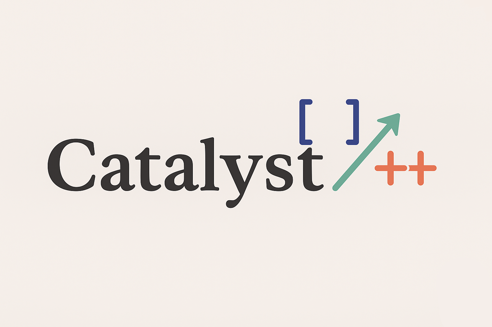

<p align="center">
  <!-- Optional: replace with your own logo -->
  
  <br />
  <br />
  <strong>Catalyst</strong>
  <br />
  Vulkan‑accelerated rendering & culling library with CPU fallbacks
  <br />
  <br />
  <!-- Badges: customize or remove as needed -->
  <a href="#"></a>
  <a href="#"></a>
  <a href="#"></a>
  <a href="#"></a>
</p>

<hr />

Catalyst is a Vulkan‑accelerated rendering and culling library with CPU fallbacks.  
It is shipped as a CMake library target (`catalyst`) that you can drop directly into your C++ project, with optional Python bindings available for scripting and experimentation.

> [!NOTE]
> Catalyst was formerly known as **Manim C++ (Vulkan GPU edition)**. The core concepts remain the same, but the project has been generalized into a reusable GPU library rather than a single application.

---

## Table of Contents

- [Features](#features)
- [Prerequisites](#prerequisites)
- [Installing Dependencies with vcpkg](#installing-dependencies-with-vcpkg)
- [Building from Source](#building-from-source)
- [Using Catalyst as a C++ Library](#using-catalyst-as-a-c-library)
- [Running Tests](#running-tests)
- [Sample: Render to File](#sample-render-to-file)
- [Python Bindings (Optional)](#python-bindings-optional)
- [Project Layout](#project-layout)
- [Implementation Notes](#implementation-notes)

---

## Features

- Vulkan‑based rendering pipeline with CPU fallback paths
- High‑performance geometry culling
- Clean C++20 API, shipped as a CMake target: `catalyst`
- Optional Python bindings via `pybind11`
- Unit and integration tests via `gtest`
- Minimal example application for GPU rendering to file

---

## Prerequisites

To build and use Catalyst you will need:

- **CMake** ≥ 3.20
- **C++20**‑capable toolchain
- **Vulkan** SDK / driver (hardware driver recommended)

Recommended dependencies via **vcpkg**:

- `vulkan-memory-allocator`
- `spdlog`
- `cli11`
- `tomlplusplus`
- `glfw3`
- `glm`
- `eigen3`
- `benchmark`
- `gtest`
- `ffmpeg`
- `freetype`
- `harfbuzz`
- `pybind11`

> [!TIP]
> You are free to provide these dependencies via your system package manager instead of vcpkg, as long as CMake can find them. The commands below show a vcpkg‑based setup.

---

## Installing Dependencies with vcpkg

One‑time vcpkg setup and dependency installation:

```bash
cd /home/adil/CPPmath-independent   # adjust to your own workspace
git clone https://github.com/microsoft/vcpkg.git
./vcpkg/bootstrap-vcpkg.sh

./vcpkg/vcpkg install \
  vulkan-memory-allocator \
  spdlog \
  cli11 \
  tomlplusplus \
  glfw3 \
  glm \
  eigen3 \
  benchmark \
  gtest \
  ffmpeg \
  freetype \
  harfbuzz \
  pybind11
```

If you prefer, you can set `VCPKG_ROOT` and use it in your CMake configuration instead of the hard‑coded path.

---

## Building from Source

Clone (or enter) the `manim-cpp` directory containing Catalyst and configure a build:

```bash
cd manim-cpp

cmake -S . -B build \
  -DCMAKE_BUILD_TYPE=Release \
  -DMANIM_ENABLE_VULKAN=ON \
  -DMANIM_BUILD_TESTS=ON

cmake --build build --config Release -j"$(nproc)"
```

### Using vcpkg as a CMake toolchain

If you installed dependencies via vcpkg, point CMake to the toolchain file:

```bash
cmake -S . -B build \
  -DCMAKE_BUILD_TYPE=Release \
  -DMANIM_ENABLE_VULKAN=ON \
  -DMANIM_BUILD_TESTS=ON \
  -DCMAKE_TOOLCHAIN_FILE=/home/adil/CPPmath-independent/vcpkg/scripts/buildsystems/vcpkg.cmake

cmake --build build --config Release -j"$(nproc)"
```

> [!CAUTION]
> If Vulkan falls back to a software implementation (e.g. `llvmpipe`), performance will be poor. Make sure your system is using your dedicated GPU driver.

To explicitly point Vulkan at a particular GPU ICD (for example, NVIDIA):

```bash
export VK_ICD_FILENAMES=/usr/share/vulkan/icd.d/nvidia_icd.json  # adjust to your system
```

---

## Using Catalyst as a C++ Library

The recommended way to consume Catalyst is as a subproject in your existing CMake build.

### Adding Catalyst as a subproject

In your project’s `CMakeLists.txt`:

```cmake
# Add Catalyst (manim-cpp) as a subdirectory
add_subdirectory(path/to/Catalyst/manim-cpp)

# Link the library target
target_link_libraries(your_app PRIVATE catalyst)

# Include Catalyst public headers
target_include_directories(your_app PRIVATE
    ${CMAKE_CURRENT_SOURCE_DIR}/manim-cpp/include
)
```

### CMake Options

Configure these options **before** calling `add_subdirectory`:

- `MANIM_ENABLE_VULKAN` (default: `ON`)  
  Enable Vulkan GPU backend. Turn this off if you only want CPU fallbacks.

- `MANIM_BUILD_TESTS` (`ON` / `OFF`)  
  Build C++ unit and integration tests.

- `MANIM_BUILD_PYTHON_BINDINGS` (`ON` / `OFF`)  
  Build the optional Python module (see [Python Bindings](#python-bindings-optional)).

---

## Running Tests

After building with `MANIM_BUILD_TESTS=ON`:

```bash
cd manim-cpp/build

# Run all CTest tests
ctest --output-on-failure
```

You can also run the Google Test binary directly and select only GPU‑related tests:

```bash
./bin/manim_tests \
  --gtest_filter="GPUComputeTest.*:GPUMemoryTest.*:GPUErrorHandling.*:MultiGPUTest.*"
```

---

## Sample: Render to File

Catalyst includes a minimal example that renders a simple GPU scene directly to an image file.

From the build directory:

```bash
cd manim-cpp/build

./bin/gpu_render_to_file --gpu output.ppm
ffmpeg -y -i output.ppm -update 1 output.png
```

If everything is set up correctly, you should see:

- A **blue circle**
- A **white dot**
- A **red ellipse**
- On a **dark background**  
  with smooth edges thanks to **4× MSAA**.

---

## Python Bindings (Optional)

If you configured the project with `MANIM_BUILD_PYTHON_BINDINGS=ON`, you can experiment with Catalyst from Python.

Create and activate a virtual environment:

```bash
python3 -m venv .venv
. .venv/bin/activate
pip install numpy
```

Once the build has completed, you can import the generated module (typically in `manim-cpp/build/python`):

```bash
PYTHONPATH=manim-cpp/build/python python - <<'PY'
import manim_cpp as m

print("GPU ready:", hasattr(m, "GPU3DScene"))
PY
```

> [!NOTE]
> The exact module name and available symbols may evolve as the bindings are expanded, but the above pattern shows the expected import and a simple capability check.

---

## Project Layout

A quick overview of the repository structure:

- `include/manim/` – Public C++ headers for the `catalyst` library
- `src/` – Library implementation
- `shaders/` – Vulkan shaders (graphics & compute)
- `examples/gpu_render_to_file.cpp` – Minimal GPU render‑to‑file sample
- `tests/` – C++ unit and integration tests
- `bindings/python/` – Optional Python bindings (via `pybind11`)

---

## Implementation Notes

- All C++ tests are currently passing.
- The Vulkan path is considered stable:
  - Geometry is rendered correctly with visible output.
  - MSAA is enabled for smooth edges.
- Backface culling is enabled (clockwise front face for the current projection).
- Fragment shader respects alpha for proper transparency handling.

> [!TIP]
> For deeper integration, inspect the `examples/` and `tests/` directories. They provide concise examples of how to set up buffers, pipelines, and scenes using Catalyst’s abstractions.
